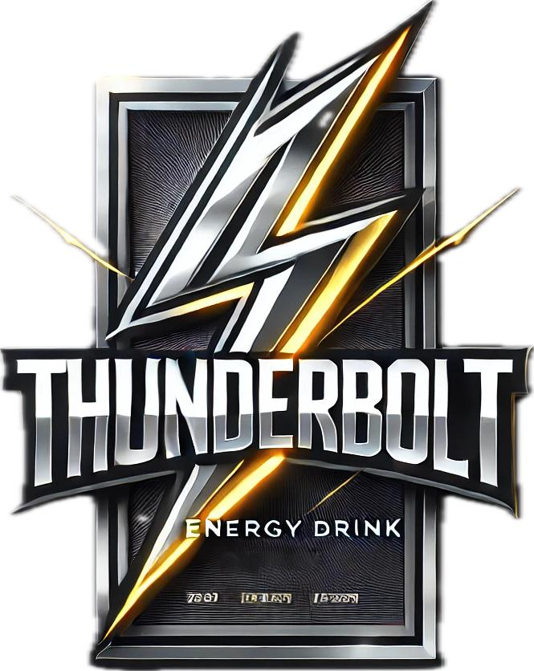

# ThunderBolt E-commerce Website



## Live Demo Check out the live demo of the ThunderBolt E-commerce website [here](https://thunderboltenergydrink.netlify.app/).

## Description
Welcome to the ThunderBolt E-commerce Website repository! This project showcases a dynamic and visually engaging e-commerce platform for ThunderBolt, an energy drink brand. The website combines CSS animations and JavaScript functionalities to provide users with an interactive and seamless shopping experience.

## Features 
- **Home Page**: Captivating homepage featuring ThunderBolt's latest products with eye-catching CSS animations. 
- **Product Listings**: Detailed product pages with high-quality images, descriptions, and pricing information.
- **Shopping Cart**: Fully functional shopping cart with add-to-cart and remove-from-cart capabilities, leveraging JavaScript for real-time updates.
- **User Authentication**: Secure user login and registration system to manage user accounts and orders.
- **Responsive Design**: Optimized for various devices and screen sizes to ensure a consistent experience across desktops, tablets, and mobiles.
- **Interactive Animations**: Smooth CSS animations to enhance user engagement and make the browsing experience enjoyable.
- **JavaScript Interactions**: Dynamic JavaScript elements for features like dropdown menus, modals, and form validations.
- **Checkout Process**: Streamlined checkout process with multiple payment options and order confirmation.

  
## Contributors
- @MeetRamatri
- @ashvin2005
- @Oashe02

## Getting Started
1. **Clone the repository**:
   ```sh
   git clone https://github.com/MeetRamatri/thunderbolt-ecommerce.git
